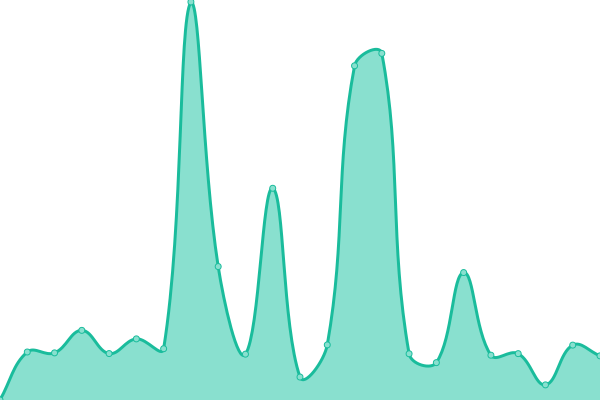
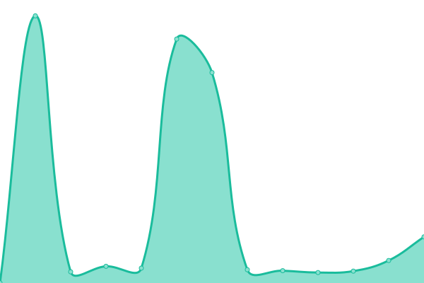
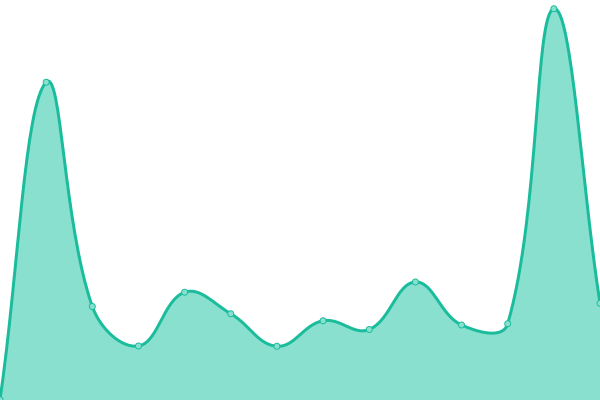
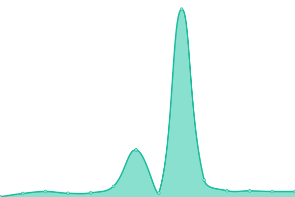
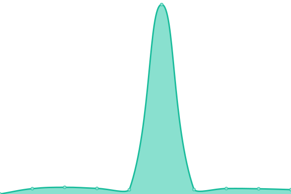
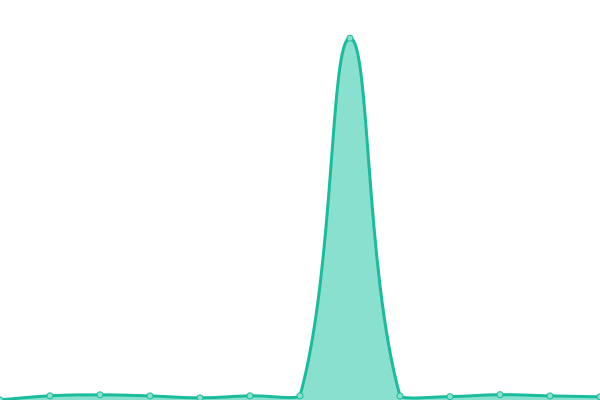
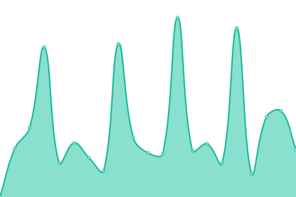
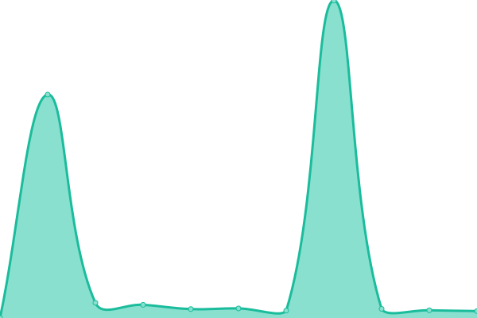
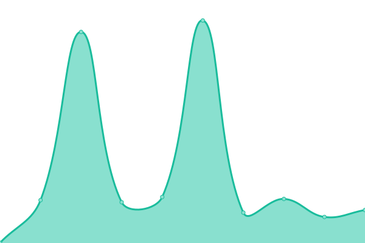
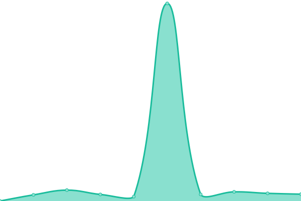

# [📈 Live Status](https://upptime.github.io/upptime): <!--live status--> **🟧 Partial outage**

This repository contains the open-source uptime monitor and status page for [Upptime](https://upptime.js.org), powered by [Upptime](https://github.com/upptime/upptime).

With [Upptime](https://upptime.js.org), you can get your own unlimited and free uptime monitor and status page, powered entirely by a GitHub repository. We use [Issues](https://github.com/upptime/upptime/issues) as incident reports, [Actions](https://github.com/fieldingtron/upptest/actions) as uptime monitors, and [Pages](https://upptime.github.io/upptime) for the status page.

<!--start: status pages-->
<!-- This summary is generated by Upptime (https://github.com/upptime/upptime) -->
<!-- Do not edit this manually, your changes will be overwritten -->
<!-- prettier-ignore -->
| URL | Status | History | Response Time | Uptime |
| --- | ------ | ------- | ------------- | ------ |
|  [Google](https://www.google.com) | 🟩 Up | [google.yml](https://github.com/fieldingtron/upptest/commits/HEAD/history/google.yml) | 

 88ms
     
 | 

<a href="https://fieldingtron.github.io/upptest/history/google">100.00%</a>
    

|  [Wikipedia](https://en.wikipedia.org) | 🟩 Up | [wikipedia.yml](https://github.com/fieldingtron/upptest/commits/HEAD/history/wikipedia.yml) | 

 149ms
     
 | 

<a href="https://fieldingtron.github.io/upptest/history/wikipedia">99.81%</a>
    

|  [Hacker News](https://news.ycombinator.com) | 🟩 Up | [hacker-news.yml](https://github.com/fieldingtron/upptest/commits/HEAD/history/hacker-news.yml) | 

 327ms
     
 | 

<a href="https://fieldingtron.github.io/upptest/history/hacker-news">100.00%</a>
    

|  [Test Broken Site](https://thissitedoesnotexist.koj.co) | 🟥 Down | [test-broken-site.yml](https://github.com/fieldingtron/upptest/commits/HEAD/history/test-broken-site.yml) | 

 0ms
     
 | 

<a href="https://fieldingtron.github.io/upptest/history/test-broken-site">100.00%</a>
    

|  [IPv6 test](forwardemail.net) | 🟥 Down | [i-pv6-test.yml](https://github.com/fieldingtron/upptest/commits/HEAD/history/i-pv6-test.yml) | 

 0ms
     
 | 

<a href="https://fieldingtron.github.io/upptest/history/i-pv6-test">100.00%</a>
    

|  [abnzb](https://abnzb.com/login) | 🟩 Up | [abnzb.yml](https://github.com/fieldingtron/upptest/commits/HEAD/history/abnzb.yml) | 

 54ms
     
 | 

<a href="https://fieldingtron.github.io/upptest/history/abnzb">98.07%</a>
    

|  [althub](https://althub.co.za) | 🟩 Up | [althub.yml](https://github.com/fieldingtron/upptest/commits/HEAD/history/althub.yml) | 

 393ms
     
 | 

<a href="https://fieldingtron.github.io/upptest/history/althub">100.00%</a>
    

|  [binnewz](https://www.forum.binnews.ninja/) | 🟩 Up | [binnewz.yml](https://github.com/fieldingtron/upptest/commits/HEAD/history/binnewz.yml) | 

 323ms
     
 | 

<a href="https://fieldingtron.github.io/upptest/history/binnewz">98.07%</a>
    

|  [binsearch](https://binsearch.info/) | 🟩 Up | [binsearch.yml](https://github.com/fieldingtron/upptest/commits/HEAD/history/binsearch.yml) | 

 289ms
     
 | 

<a href="https://fieldingtron.github.io/upptest/history/binsearch">100.00%</a>
    

|  [binzb](http://binzb.com/) | 🟩 Up | [binzb.yml](https://github.com/fieldingtron/upptest/commits/HEAD/history/binzb.yml) | 

 221ms
     
 | 

<a href="https://fieldingtron.github.io/upptest/history/binzb">98.06%</a>
    

|  [birds-of-binaries](https://birds-of-binaries.com/forum/index.php?dashboard/) | 🟩 Up | [birds-of-binaries.yml](https://github.com/fieldingtron/upptest/commits/HEAD/history/birds-of-binaries.yml) | 

 796ms
     
 | 

<a href="https://fieldingtron.github.io/upptest/history/birds-of-binaries">97.52%</a>
    

|  [bluraynzb](https://www.bluraynzb.org/) | 🟩 Up | [bluraynzb.yml](https://github.com/fieldingtron/upptest/commits/HEAD/history/bluraynzb.yml) | 

 536ms
     
 | 

<a href="https://fieldingtron.github.io/upptest/history/bluraynzb">100.00%</a>
    

|  [brothers-of-usenet](https://www.brothers-of-usenet.net/) | 🟩 Up | [brothers-of-usenet.yml](https://github.com/fieldingtron/upptest/commits/HEAD/history/brothers-of-usenet.yml) | 

 6ms
     
 | 

<a href="https://fieldingtron.github.io/upptest/history/brothers-of-usenet">98.06%</a>
    

|  [dognzb](https://dognzb.cr/login) | 🟩 Up | [dognzb.yml](https://github.com/fieldingtron/upptest/commits/HEAD/history/dognzb.yml) | 

 2519ms
     
 | 

<a href="https://fieldingtron.github.io/upptest/history/dognzb">98.05%</a>
    

|  [drunken-slug](https://drunkenslug.com/) | 🟩 Up | [drunken-slug.yml](https://github.com/fieldingtron/upptest/commits/HEAD/history/drunken-slug.yml) | 

 517ms
     
 | 

<a href="https://fieldingtron.github.io/upptest/history/drunken-slug">98.05%</a>
    

|  [easy-leech](https://easy-leech.to/) | 🟩 Up | [easy-leech.yml](https://github.com/fieldingtron/upptest/commits/HEAD/history/easy-leech.yml) | 

 125ms
     
 | 

<a href="https://fieldingtron.github.io/upptest/history/easy-leech">100.00%</a>
    

|  [elitenzb](https://www.elitenzb.info/) | 🟩 Up | [elitenzb.yml](https://github.com/fieldingtron/upptest/commits/HEAD/history/elitenzb.yml) | 

 457ms
     
 | 

<a href="https://fieldingtron.github.io/upptest/history/elitenzb">99.23%</a>
    

|  [fileleechers](https://fileleechers.info/board/index.php?login/&url=https%3A%2F%2Ffileleechers.info%2Fboard%2F) | 🟩 Up | [fileleechers.yml](https://github.com/fieldingtron/upptest/commits/HEAD/history/fileleechers.yml) | 

 410ms
     
 | 

<a href="https://fieldingtron.github.io/upptest/history/fileleechers">99.64%</a>
    

|  [FileSharingTalk](https://filesharingtalk.com/nzbs/) | 🟩 Up | [file-sharing-talk.yml](https://github.com/fieldingtron/upptest/commits/HEAD/history/file-sharing-talk.yml) | 

 6ms
     
 | 

<a href="https://fieldingtron.github.io/upptest/history/file-sharing-talk">98.04%</a>
    

|  [findnzb](http://findnzb.net/) | 🟩 Up | [findnzb.yml](https://github.com/fieldingtron/upptest/commits/HEAD/history/findnzb.yml) | 

 6ms
     
 | 

<a href="https://fieldingtron.github.io/upptest/history/findnzb">98.04%</a>
    

|  [gingadaddy](https://www.gingadaddy.com) | 🟩 Up | [gingadaddy.yml](https://github.com/fieldingtron/upptest/commits/HEAD/history/gingadaddy.yml) | 

 351ms
     
 | 

<a href="https://fieldingtron.github.io/upptest/history/gingadaddy">100.00%</a>
    

|  [headphones-vip](https://headphones.codeshy.com/vip/) | 🟩 Up | [headphones-vip.yml](https://github.com/fieldingtron/upptest/commits/HEAD/history/headphones-vip.yml) | 

 536ms
     
 | 

<a href="https://fieldingtron.github.io/upptest/history/headphones-vip">100.00%</a>
    

|  [house-of-usenet](https://house-of-usenet.com/login) | 🟩 Up | [house-of-usenet.yml](https://github.com/fieldingtron/upptest/commits/HEAD/history/house-of-usenet.yml) | 

 655ms
     
 | 

<a href="https://fieldingtron.github.io/upptest/history/house-of-usenet">100.00%</a>
    

|  [miatrix](https://www.miatrix.com) | 🟩 Up | [miatrix.yml](https://github.com/fieldingtron/upptest/commits/HEAD/history/miatrix.yml) | 

 183ms
     
 | 

<a href="https://fieldingtron.github.io/upptest/history/miatrix">100.00%</a>
    

|  [newz-complex](https://newz-complex.org/) | 🟩 Up | [newz-complex.yml](https://github.com/fieldingtron/upptest/commits/HEAD/history/newz-complex.yml) | 

 934ms
     
 | 

<a href="https://fieldingtron.github.io/upptest/history/newz-complex">91.04%</a>
    

|  [newzfinders](http://en.newzfinders.com/) | 🟩 Up | [newzfinders.yml](https://github.com/fieldingtron/upptest/commits/HEAD/history/newzfinders.yml) | 

 1368ms
     
 | 

<a href="https://fieldingtron.github.io/upptest/history/newzfinders">99.19%</a>
    

|  [newznzb](https://newznzb.info/) | 🟩 Up | [newznzb.yml](https://github.com/fieldingtron/upptest/commits/HEAD/history/newznzb.yml) | 

 55ms
     
 | 

<a href="https://fieldingtron.github.io/upptest/history/newznzb">0.00%</a>
    

|  [ninjacentral](http://ninjacentral.co.za/) | 🟩 Up | [ninjacentral.yml](https://github.com/fieldingtron/upptest/commits/HEAD/history/ninjacentral.yml) | 

 97ms
     
 | 

<a href="https://fieldingtron.github.io/upptest/history/ninjacentral">98.04%</a>
    

|  [nzbking](http://www.nzbking.com/) | 🟩 Up | [nzbking.yml](https://github.com/fieldingtron/upptest/commits/HEAD/history/nzbking.yml) | 

 548ms
     
 | 

<a href="https://fieldingtron.github.io/upptest/history/nzbking">100.00%</a>
    

|  [nzbnation](http://nzbnation.com/) | 🟩 Up | [nzbnation.yml](https://github.com/fieldingtron/upptest/commits/HEAD/history/nzbnation.yml) | 

 517ms
     
 | 

<a href="https://fieldingtron.github.io/upptest/history/nzbnation">99.34%</a>
    

|  [NZB Su](https://www.nzb.su/) | 🟩 Up | [nzb-su.yml](https://github.com/fieldingtron/upptest/commits/HEAD/history/nzb-su.yml) | 

 466ms
     
 | 

<a href="https://fieldingtron.github.io/upptest/history/nzb-su">97.83%</a>
    

|  [nzbwolf](https://nzbwolf.com/) | 🟩 Up | [nzbwolf.yml](https://github.com/fieldingtron/upptest/commits/HEAD/history/nzbwolf.yml) | 

 502ms
     
 | 

<a href="https://fieldingtron.github.io/upptest/history/nzbwolf">100.00%</a>
    

|  [nzbcat](https://nzb.cat) | 🟩 Up | [nzbcat.yml](https://github.com/fieldingtron/upptest/commits/HEAD/history/nzbcat.yml) | 

 24ms
     
 | 

<a href="https://fieldingtron.github.io/upptest/history/nzbcat">98.03%</a>
    

|  [nzbcave](https://www.nzbcave.co.uk/v3/index.php) | 🟩 Up | [nzbcave.yml](https://github.com/fieldingtron/upptest/commits/HEAD/history/nzbcave.yml) | 

 4573ms
     
 | 

<a href="https://fieldingtron.github.io/upptest/history/nzbcave">99.42%</a>
    

|  [nzbfinder](https://nzbfinder.ws/) | 🟩 Up | [nzbfinder.yml](https://github.com/fieldingtron/upptest/commits/HEAD/history/nzbfinder.yml) | 

 603ms
     
 | 

<a href="https://fieldingtron.github.io/upptest/history/nzbfinder">98.03%</a>
    

|  [nzbforyou](https://www.nzbforyou.com/) | 🟩 Up | [nzbforyou.yml](https://github.com/fieldingtron/upptest/commits/HEAD/history/nzbforyou.yml) | 

 466ms
     
 | 

<a href="https://fieldingtron.github.io/upptest/history/nzbforyou">100.00%</a>
    

|  [NZBFriends](http://nzbfriends.com/) | 🟩 Up | [nzb-friends.yml](https://github.com/fieldingtron/upptest/commits/HEAD/history/nzb-friends.yml) | 

 58ms
     
 | 

<a href="https://fieldingtron.github.io/upptest/history/nzb-friends">98.03%</a>
    

|  [nzbgeek](https://nzbgeek.info) | 🟩 Up | [nzbgeek.yml](https://github.com/fieldingtron/upptest/commits/HEAD/history/nzbgeek.yml) | 

 456ms
     
 | 

<a href="https://fieldingtron.github.io/upptest/history/nzbgeek">98.03%</a>
    

|  [NZBGrabit](https://www.nzbgrabit.org/forum.php) | 🟩 Up | [nzb-grabit.yml](https://github.com/fieldingtron/upptest/commits/HEAD/history/nzb-grabit.yml) | 

 66ms
     
 | 

<a href="https://fieldingtron.github.io/upptest/history/nzb-grabit">98.03%</a>
    

|  [nzbhunter](https://nzbhunter.com/) | 🟩 Up | [nzbhunter.yml](https://github.com/fieldingtron/upptest/commits/HEAD/history/nzbhunter.yml) | 

 2628ms
     
 | 

<a href="https://fieldingtron.github.io/upptest/history/nzbhunter">98.81%</a>
    

|  [nzb-id](https://nzbid.net/) | 🟩 Up | [nzb-id.yml](https://github.com/fieldingtron/upptest/commits/HEAD/history/nzb-id.yml) | 

 0ms
     
 | 

<a href="https://fieldingtron.github.io/upptest/history/nzb-id">98.03%</a>
    

|  [nzbindex](https://www.nzbindex.com/search) | 🟩 Up | [nzbindex.yml](https://github.com/fieldingtron/upptest/commits/HEAD/history/nzbindex.yml) | 

 1465ms
     
 | 

<a href="https://fieldingtron.github.io/upptest/history/nzbindex">100.00%</a>
    

|  [NZBIndex.nl](https://nzbindex.nl/) | 🟩 Up | [nzb-index-nl.yml](https://github.com/fieldingtron/upptest/commits/HEAD/history/nzb-index-nl.yml) | 

 891ms
     
 | 

<a href="https://fieldingtron.github.io/upptest/history/nzb-index-nl">100.00%</a>
    

|  [nzbnewzfrance](https://www.nzbnewzfrance.ninja/) | 🟩 Up | [nzbnewzfrance.yml](https://github.com/fieldingtron/upptest/commits/HEAD/history/nzbnewzfrance.yml) | 

 119ms
     
 | 

<a href="https://fieldingtron.github.io/upptest/history/nzbnewzfrance">100.00%</a>
    

|  [nzbnoob](https://nzbnoob.com) | 🟩 Up | [nzbnoob.yml](https://github.com/fieldingtron/upptest/commits/HEAD/history/nzbnoob.yml) | 

 100ms
     
 | 

<a href="https://fieldingtron.github.io/upptest/history/nzbnoob">98.02%</a>
    

|  [nzbplanet](https://nzbplanet.net/) | 🟩 Up | [nzbplanet.yml](https://github.com/fieldingtron/upptest/commits/HEAD/history/nzbplanet.yml) | 

 90ms
     
 | 

<a href="https://fieldingtron.github.io/upptest/history/nzbplanet">98.02%</a>
    

|  [nzbs2go](https://nzbs2go.com/login) | 🟩 Up | [nzbs2go.yml](https://github.com/fieldingtron/upptest/commits/HEAD/history/nzbs2go.yml) | 

 50ms
     
 | 

<a href="https://fieldingtron.github.io/upptest/history/nzbs2go">100.00%</a>
    

|  [nzbscc](https://nzbs.cc/) | 🟩 Up | [nzbscc.yml](https://github.com/fieldingtron/upptest/commits/HEAD/history/nzbscc.yml) | 

 50ms
     
 | 

<a href="https://fieldingtron.github.io/upptest/history/nzbscc">0.00%</a>
    

|  [nzbscout](https://nzbscout.com/) | 🟩 Up | [nzbscout.yml](https://github.com/fieldingtron/upptest/commits/HEAD/history/nzbscout.yml) | 

 50ms
     
 | 

<a href="https://fieldingtron.github.io/upptest/history/nzbscout">100.00%</a>
    

|  [nzbserver](http://www.nzbserver.com) | 🟩 Up | [nzbserver.yml](https://github.com/fieldingtron/upptest/commits/HEAD/history/nzbserver.yml) | 

 583ms
     
 | 

<a href="https://fieldingtron.github.io/upptest/history/nzbserver">98.01%</a>
    

|  [nzbstars](https://www.nzbstars.com/) | 🟩 Up | [nzbstars.yml](https://github.com/fieldingtron/upptest/commits/HEAD/history/nzbstars.yml) | 

 172ms
     
 | 

<a href="https://fieldingtron.github.io/upptest/history/nzbstars">98.01%</a>
    

|  [nzbxs](https://www.nzbxs.com/) | 🟩 Up | [nzbxs.yml](https://github.com/fieldingtron/upptest/commits/HEAD/history/nzbxs.yml) | 

 520ms
     
 | 

<a href="https://fieldingtron.github.io/upptest/history/nzbxs">98.29%</a>
    

|  [omgwtfnzbs](https://omgwtfnzbs.me/login) | 🟩 Up | [omgwtfnzbs.yml](https://github.com/fieldingtron/upptest/commits/HEAD/history/omgwtfnzbs.yml) | 

 2033ms
     
 | 

<a href="https://fieldingtron.github.io/upptest/history/omgwtfnzbs">98.66%</a>
    

|  [pourcesoir](https://pourcesoir.in/) | 🟥 Down | [pourcesoir.yml](https://github.com/fieldingtron/upptest/commits/HEAD/history/pourcesoir.yml) | 

 1424ms
     
 | 

<a href="https://fieldingtron.github.io/upptest/history/pourcesoir">98.34%</a>
    

|  [scenenzbs](https://scenenzbs.com/) | 🟩 Up | [scenenzbs.yml](https://github.com/fieldingtron/upptest/commits/HEAD/history/scenenzbs.yml) | 

 4437ms
     
 | 

<a href="https://fieldingtron.github.io/upptest/history/scenenzbs">99.77%</a>
    

|  [Sky of Usenet](https://sky-of-use.net/index.php?login/&url=https%3A%2F%2Fsky-of-use.net%2F) | 🟩 Up | [sky-of-usenet.yml](https://github.com/fieldingtron/upptest/commits/HEAD/history/sky-of-usenet.yml) | 

 143ms
     
 | 

<a href="https://fieldingtron.github.io/upptest/history/sky-of-usenet">97.98%</a>
    

|  [tabula-rasa](https://www.tabula-rasa.pw) | 🟩 Up | [tabula-rasa.yml](https://github.com/fieldingtron/upptest/commits/HEAD/history/tabula-rasa.yml) | 

 544ms
     
 | 

<a href="https://fieldingtron.github.io/upptest/history/tabula-rasa">99.69%</a>
    

|  [The Hive](http://www.the-hive.be/forum/) | 🟩 Up | [the-hive.yml](https://github.com/fieldingtron/upptest/commits/HEAD/history/the-hive.yml) | 

 1570ms
     
 | 

<a href="https://fieldingtron.github.io/upptest/history/the-hive">100.00%</a>
    

|  [Usenet Hub](http://usenethub.com/) | 🟩 Up | [usenet-hub.yml](https://github.com/fieldingtron/upptest/commits/HEAD/history/usenet-hub.yml) | 

 1005ms
     
 | 

<a href="https://fieldingtron.github.io/upptest/history/usenet-hub">100.00%</a>
    

|  [usenetcrawler](http://usenet-crawler.com) | 🟩 Up | [usenetcrawler.yml](https://github.com/fieldingtron/upptest/commits/HEAD/history/usenetcrawler.yml) | 

 2420ms
     
 | 

<a href="https://fieldingtron.github.io/upptest/history/usenetcrawler">98.34%</a>
    

|  [usenethd](https://www.usenethd.li/login/) | 🟩 Up | [usenethd.yml](https://github.com/fieldingtron/upptest/commits/HEAD/history/usenethd.yml) | 

 678ms
     
 | 

<a href="https://fieldingtron.github.io/upptest/history/usenethd">100.00%</a>
    

|  [wtfnzb](http://wtfnzb.pw/) | 🟩 Up | [wtfnzb.yml](https://github.com/fieldingtron/upptest/commits/HEAD/history/wtfnzb.yml) | 

 75ms
     
 | 

<a href="https://fieldingtron.github.io/upptest/history/wtfnzb">97.98%</a>
    

|  [spots-xenetix-nl](https://spots.xenetix.nl/spotweb/) | 🟩 Up | [spots-xenetix-nl.yml](https://github.com/fieldingtron/upptest/commits/HEAD/history/spots-xenetix-nl.yml) | 

 6ms
     
 | 

<a href="https://fieldingtron.github.io/upptest/history/spots-xenetix-nl">97.97%</a>
    

<!--end: status pages-->

[**Visit our status website →**](https://upptime.github.io/upptime)

## 📄 License

- Powered by: [Upptime](https://github.com/upptime/upptime)
- Code: [MIT](./LICENSE) © [Anand Chowdhary](https://anandchowdhary.com), supported by [Pabio](https://pabio.com)
- Data in the `./history` directory: [Open Database License](https://opendatacommons.org/licenses/odbl/1-0/)
